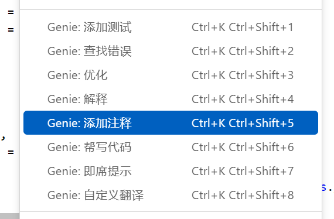

## ChatGPT - Genie AI  插件微调

### 1. 菜单翻译

### 2. 默认使用接口代理

https://proxy.aidashi.wiki/

免费key，无需翻墙， 详情访问上面的链接

### 3. Prompt 调整，增加中文响应

建议先阅读教程《借助ChatGPT提高编程效率指南》：https://mp.weixin.qq.com/s/DBi6EqrKnDCf5oe1IL5H5A

### 4. 增加模型

新增并默认使用最新的模型：`gpt-3.5-turbo-16k-0613`

支持大段代码提问。

### 5. 打包成  `.vsix` 文件

下载原版插件：
[ChatGPT - Genie AI](https://marketplace.visualstudio.com/_apis/public/gallery/publishers/genieai/vsextensions/chatgpt-vscode/0.0.8/vspackage)

将 `genieai.chatgpt-vscode-0.0.8.vsix`  改为 `genieai.chatgpt-vscode-0.0.8.zip`

用压缩软件打开，手动一个个替换文件，然后将压缩重命名成 `genieai.chatgpt-vscode-0.0.8.vsix`

本项目中的：`genieai.chatgpt-vscode-0.0.8.vsix` 文件是处理过后的文件， 放心可以直接使用。

### 6. 安装

下载 `genieai.chatgpt-vscode-0.0.8.vsix` 文件，然后在 vscode 中安装即可。
